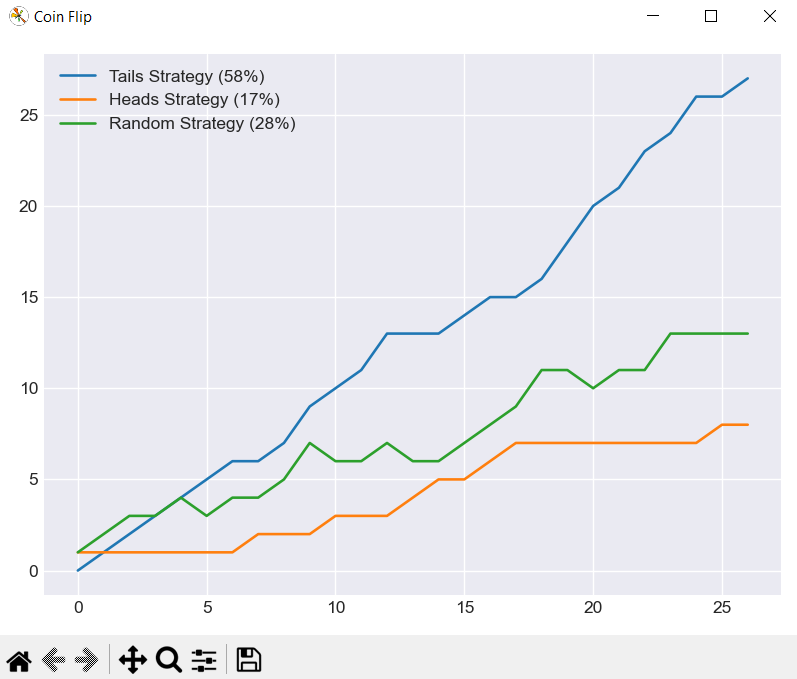

# Sleeping Beauty Coin Flip Experiment

## Introduction
I was inspired to create a python scrip that would calculate the percentages in the Veritasium video https://www.youtube.com/watch?v=XeSu9fBJ2sI

## Usage

### Two Options Available

#### Option 1
1. Download the executable file from the releases page here: https://github.com/steakbbq/sleeping_beauty_coin_flips/releases
2. Run the executable file

#### Option 2
1. Downlaod Python3 from https://www.python.org/downloads/
2. Open a command prompt and run the following commands:

`python -m pip install -U pip`

`python -m pip install -U matplotlib`

3. Navigate to the directory that has main.py and run the following command:

`python main.py`

## Methodology
The program flips a coin, the three strategies keep track of wins and the percentage is how many times each strategy guessed correctly.

If tails is flipped, another coin is flipped and the result is tracked.

## Conclusion

Undecided